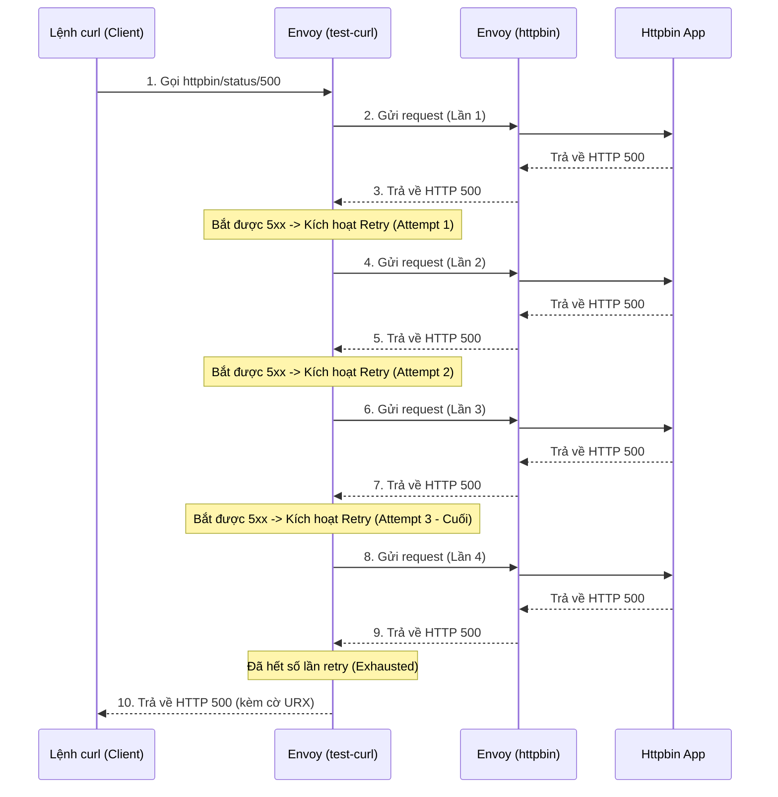

# Hướng dẫn thực hành cấu hình Service Mesh trên K8S (Istio)

Tài liệu này hướng dẫn các bước thực hành cấu hình Service Mesh (mTLS, chính sách kết nối và Retry) trên Kubernetes cho ứng dụng YAS theo yêu cầu đồ án.

## Giai đoạn 1: Lắp đặt "Bộ não" Istio và "Mắt thần" Kiali

### Bước 1: Cài đặt Istio
Đầu tiên, bạn cần tải và cài đặt Istio vào cluster Kubernetes. Mở terminal của máy ảo (Master node) và chạy:
```bash
curl -L https://istio.io/downloadIstio | sh -
cd istio-*
export PATH=$PWD/bin:$PATH
istioctl install --set profile=demo -y
```

### Bước 2: Cài đặt công cụ quan trắc (Kiali & Prometheus)
Istio có cung cấp sẵn một bộ công cụ add-ons. Kiali cần Prometheus để lấy dữ liệu vẽ biểu đồ.
```bash
kubectl apply -f samples/addons
```

### Bước 3: "Tiêm" Proxy vào các Service hiện tại
Để Istio kiểm soát được giao tiếp, mỗi pod của bạn cần một "vệ sĩ" (sidecar proxy) đứng kèm.
```bash
# Bật tính năng tự động tiêm proxy cho namespace (thay yas-env bằng namespace thực tế của bạn, vd: dev)
kubectl label namespace yas-env istio-injection=enabled

# Khởi động lại toàn bộ pod để chúng nhận proxy mới
kubectl rollout restart deployment -n yas-env
```
*(Bạn chạy `kubectl get pods -n yas-env` sẽ thấy cột READY hiển thị 2/2 thay vì 1/1 là thành công).*

---

## Giai đoạn 2: Cấu hình mTLS và vẽ Topology

### 1. Bật TLS (mTLS) giữa các service
Sử dụng `PeerAuthentication` để yêu cầu các service giao tiếp với nhau bằng mTLS:
```bash
kubectl apply -f environments/dev/service_mesh/mtls-peer-auth.yaml
```
*Lưu ý: Bạn có thể cần thiết lập mode `PERMISSIVE` cho các service nhận traffic trực tiếp từ Ingress (như BFF) và `STRICT` cho các service nội bộ.*

### 2. Vẽ flow chart/Topology của các service
- Sau khi bật mTLS và tạo ra các request (traffic) để hệ thống hoạt động, mở giao diện Kiali (thường qua lệnh port-forward port `20001`).
- Vào mục **Graph**, chọn namespace ứng dụng của bạn (ví dụ: `dev`).
- Bật hiển thị **Security Badges** (biểu tượng ổ khóa) trong phần menu **Display** để xác nhận mTLS đã được kích hoạt thành công giữa các node.

---

## Giai đoạn 3: Kế hoạch & Phân tích Test Retry trong Istio

*(Phần này được tích hợp từ cấu hình và tài liệu phân tích Retry)*

Tài liệu này mô tả chi tiết cách thức hoạt động, mô hình và các bước kiểm thử cơ chế Retry tự động của Istio (Envoy proxy) khi các service gặp lỗi.

### 3.1. Mục tiêu
Đảm bảo rằng khi một Service (Upstream) gặp lỗi hoặc quá tải (trả về lỗi 5xx), Istio Sidecar (Envoy) của Client (Caller) sẽ tự động thử lại request một số lần nhất định trước khi thực sự báo lỗi về cho người dùng. Điều này giúp hệ thống chịu lỗi tốt hơn (Resilience).

### 3.2. Mô hình Test

Chúng ta cần 3 thành phần chính:
1. **Caller (Client):** Một Pod nằm trong Istio mesh (đã được inject Envoy sidecar). Trong bài test, chúng ta sử dụng `test-curl`.
2. **Upstream (Server):** Một Pod đóng vai trò là backend, có khả năng trả về lỗi giả lập. Ở đây chúng ta dùng `httpbin` (có sẵn các API giả lập lỗi như `/status/500`).
3. **VirtualService:** Cấu hình routing của Istio để định nghĩa luật Retry (ví dụ: retry 3 lần, mỗi lần cách nhau 2s, áp dụng cho lỗi 5xx).



### 3.3. Các bước thực hiện

#### Bước 1: Chuẩn bị môi trường (Apply Manifests)
Áp dụng file cấu hình bao gồm `VirtualService` (định nghĩa retry), `Pod/Service httpbin` và `Pod test-curl`.

```bash
kubectl apply -f environments/dev/service_mesh/retry/4-httpbin-retry-test.yaml
```

#### Bước 2: Kích hoạt request kiểm thử
Gửi một request từ pod `test-curl` đến `httpbin`, yêu cầu httpbin trả về lỗi 500.

```bash
kubectl exec -n dev test-curl -c curl -- curl -s -o /dev/null -w "%{http_code}" http://httpbin/status/500
```

#### Bước 3: Phân tích kết quả (Logs)

Để xác nhận Istio có thực hiện Retry hay không, chúng ta kiểm tra log của Envoy ở cả hai đầu.

> **Dấu hiệu thành công:** Log của Caller (test-curl) chỉ có 1 dòng ghi nhận lỗi (kèm cờ URX), trong khi log của Upstream (httpbin) có nhiều dòng (1 gốc + số lần retry) với cùng một Request ID.

**3.3.1. Kiểm tra log của Caller (`test-curl`)**
```bash
kubectl logs -n dev test-curl -c istio-proxy --tail=10
```
*Kết quả kỳ vọng:* Thấy log có đoạn `500 URX via_upstream`.
- `URX`: Upstream Retry Exhausted. Chứng tỏ cơ chế retry đã chạy nhưng hết số lần cho phép.
- `x_envoy_attempt_count`: Sẽ bằng 4 (1 gốc + 3 retry).

**3.3.2. Kiểm tra log của Upstream (`httpbin`)**
```bash
kubectl logs -n dev httpbin -c istio-proxy --tail=20 | grep "GET /status/500"
```
*Kết quả kỳ vọng:* Có 4 dòng log liên tiếp tại cùng một thời điểm với chung một `X-Request-Id`. Điều này khẳng định 1 request gốc từ người dùng đã được Envoy nhân lên thành 4 request thực tế gửi đến backend.

### 3.4. Kiểm tra trực quan trên Kiali / Jaeger (Tuỳ chọn)

Ngoài việc đọc log, bạn có thể kiểm chứng qua UI:
- **Kiali (`localhost:20001`):** Xem Topology Graph, chọn namespace `dev`. Traffic sẽ hiển thị tỷ lệ lỗi (Error rate) tương ứng với số lượng request bị đánh rớt.
- **Jaeger (`localhost:16686`):** Tìm Trace của `test-curl`. Bạn sẽ thấy một Trace dài bao gồm nhiều Span con (mỗi span tương ứng với một lần thử lại).

---

## Giai đoạn 4: Cấu hình phân quyền truy cập (Authorization Policy)

Tài liệu này hướng dẫn cách áp dụng các chính sách phân quyền (AuthorizationPolicy) để kiểm soát luồng giao tiếp (Traffic Control/RBAC) giữa các service trong Istio, dựa trên cấu hình tại `environments/dev/service_mesh/auth-policy.yaml`.

### 4.1. Mục tiêu của chính sách
Cấu hình trong file định nghĩa các quy tắc bảo mật sau:
1. **Public Access cho BFF:** Mở quyền truy cập hoàn toàn (ALLOW) cho hai cổng giao tiếp chính là `storefront-bff` và `backoffice-bff` để Ingress Gateway có thể gọi vào bình thường.
2. **Kiểm soát truy cập service `search`:** Service `search` được bảo vệ nghiêm ngặt hơn:
   - Chỉ cho phép các service cụ thể (dựa trên Service Account `product`, `storefront-bff`, `backoffice-bff`) được phép gọi vào.
   - Mở exception cho phép truy cập công khai vào các endpoint tài liệu API (Swagger UI, `/v3/api-docs`).
   - Cho phép truy cập vào cổng `8090` (cổng metric) để Prometheus có thể thu thập dữ liệu.

### 4.2. Cách cài đặt (Apply Policy)
Áp dụng file cấu hình vào cụm Kubernetes bằng lệnh sau:
```bash
kubectl apply -f environments/dev/service_mesh/auth-policy.yaml
```

### 4.3. Kiểm tra (Verify)
Sau khi cài đặt, bạn có thể kiểm chứng bằng cách:
- Thử gửi request từ một pod **không được cấp quyền** (ví dụ `cart` hoặc `httpbin`) đến service `search`, request sẽ bị Envoy Proxy chặn lại ngay lập tức và trả về mã lỗi HTTP `403 RBAC: access denied`.
- Các request từ pod hợp lệ (`storefront-bff`) hoặc gọi vào các đường dẫn Swagger UI sẽ đi qua bình thường (mã `200 OK`).
