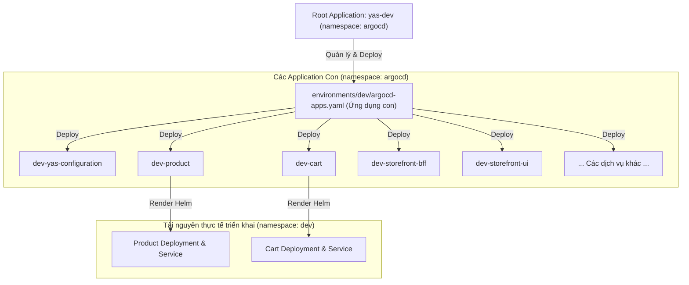
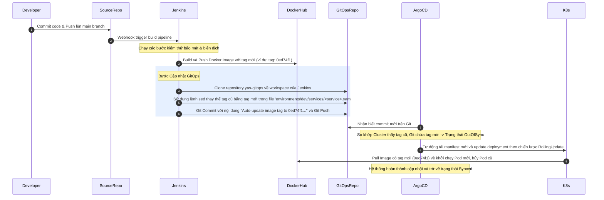

# Hướng Dẫn Quản Lý GitOps Với ArgoCD

Tài liệu này mô tả chi tiết phương pháp vận hành GitOps, kiến trúc triển khai ứng dụng dạng **App-of-Apps** sử dụng **ArgoCD**, cấu trúc thư mục của repository cấu hình, và quy trình tự động hóa cập nhật phiên bản ứng dụng YAS.

---

## 1. Nguyên Lý Vận Hành GitOps Với ArgoCD

**GitOps** là phương pháp vận hành hệ thống lấy mã nguồn (Git) làm **Nguồn chân lý duy nhất (Single Source of Truth)** cho toàn bộ cấu hình hạ tầng và ứng dụng.

Trong hệ thống YAS, nguyên lý hoạt động được đảm bảo như sau:
1. **Khai báo cấu hình (Declarative):** Toàn bộ trạng thái mong muốn của Kubernetes Cluster (Deployments, Services, Ingresses, Istio Policies) đều được khai báo dạng code (YAML/Helm charts) và lưu trữ trong Git repository `yas-gitops`.
2. **ArgoCD Operator:** Chạy trực tiếp bên trong Kubernetes Cluster (namespace `argocd`), liên tục lắng nghe và đối chiếu trạng thái thực tế đang chạy trên cluster (**Live State**) với trạng thái khai báo trên Git (**Target State**).
3. **Đồng bộ tự động & Tự sửa lỗi (Sync & Self-healing):**
   - **Out-of-Sync:** Khi phát hiện trạng thái trên Git thay đổi so với Cluster, ArgoCD đánh dấu tài nguyên là `OutOfSync` và tự động cập nhật xuống Cluster.
   - **Self-Healing:** Nếu quản trị viên cố tình sửa đổi tài nguyên trực tiếp trên Cluster bằng lệnh `kubectl edit`, ArgoCD sẽ lập tức ghi đè cấu hình đã khai báo trong Git lên tài nguyên đó để ngăn ngừa trôi lệch cấu hình (**Configuration Drift**).

---

## 2. Kiến Trúc App-of-Apps Pattern

Để tránh việc phải tạo thủ công hàng chục ứng dụng microservice riêng lẻ trên giao diện ArgoCD, hệ thống YAS áp dụng mô hình thiết kế **App-of-Apps Pattern (Ứng dụng của các ứng dụng)**.

### Sơ đồ kiến trúc App-of-Apps



### Cách thức hoạt động:
1. **Root Application (`yas-dev`):** Được định nghĩa tại [infrastructure/argocd/yas-dev.yaml](file:///home/nhatthanh/yas-gitops/infrastructure/argocd/yas-dev.yaml).
   - Ứng dụng này theo dõi thư mục `environments/dev/` trong Git.
   - Nó loại bỏ các file cấu hình chi tiết (nhờ cấu hình `directory.exclude`) và chỉ tập trung đồng bộ tệp [environments/dev/argocd-apps.yaml](file:///home/nhatthanh/yas-gitops/environments/dev/argocd-apps.yaml).
2. **Child Applications (`argocd-apps.yaml`):** Chứa danh sách tài nguyên kiểu `Application` của ArgoCD dành cho từng microservice (như `dev-cart`, `dev-product`).
   - Mỗi `Application` con này sẽ định vị chính xác đường dẫn đến Helm Chart của dịch vụ tương ứng (ví dụ: `charts/product`) và nạp các tệp giá trị cấu hình tương ứng (`values-shared.yaml` và `services/product.yaml`).

---

## 3. Cấu Trúc Thư Mục Của GitOps Repository (`yas-gitops`)

Repository `yas-gitops` được tổ chức một cách khoa học để quản lý mã nguồn Helm Charts và các tham số môi trường biệt lập:

```text
yas-gitops/
├── charts/                           # 1. Thư mục chứa các Helm Chart của YAS
│   ├── backend/                      # Chart cha dùng chung cho các service backend Java
│   ├── ui/                           # Chart cha dùng chung cho các ứng dụng Frontend React
│   ├── product/                      # Chart kế thừa của service Product
│   ├── cart/                         # Chart kế thừa của service Cart
│   └── ...                           # Các Helm chart khác của YAS
│
├── environments/                     # 2. Thư mục cấu hình cho từng môi trường
│   ├── dev/                          # Môi trường Development
│   │   ├── argocd-apps.yaml          # File định nghĩa App-of-Apps chứa các application con
│   │   ├── values-shared.yaml        # Cấu hình chung cho toàn bộ các pod thuộc môi trường Dev
│   │   ├── nginx-api-gateway.yaml    # ConfigMap và Ingress cấu hình API Gateway Dev
│   │   ├── services/                 # Thư mục override cấu hình cho từng service riêng lẻ
│   │   │   ├── product.yaml          # Chứa thông tin ghi đè tag hình ảnh của service product
│   │   │   └── storefront-bff.yaml   # Chứa cấu hình domain và tag hình ảnh của storefront-bff
│   │   └── service_mesh/             # Cấu hình Istio (mTLS, Authorization, VS Retry) cho Dev
│   │
│   └── staging/                      # Môi trường Staging (Cấu trúc tương tự môi trường Dev)
│       ├── argocd-apps.yaml
│       ├── values-shared.yaml
│       ├── nginx-api-gateway.yaml
│       └── services/                 # Chứa tag hình ảnh phiên bản chính thức (ví dụ tag: v1.0.0)
│
└── infrastructure/                   # 3. Thư mục chứa tài nguyên root của ArgoCD và scripts cài đặt
    ├── argocd/
    │   ├── yas-dev.yaml              # Root Application quản lý môi trường Dev
    │   └── yas-staging.yaml          # Root Application quản lý môi trường Staging
    └── scripts/                      # Các kịch bản bash setup hạ tầng PostgreSQL, Kafka, Elastic, v.v.
```

---

## 4. Quy Trình Tự Động Hóa Đồng Bộ Phiên Bản (CI/CD GitOps Loop)

Khi có một sự thay đổi mã nguồn từ phía lập trình viên, quy trình cập nhật diễn ra hoàn toàn tự động qua các bước sau:



---

## 5. Hướng Dẫn Vận Hành Hệ Thống Qua CLI

Bên cạnh giao diện UI Web, bạn có thể thực hiện quản lý ArgoCD thông qua câu lệnh Kubernetes (`kubectl`) hoặc ArgoCD CLI.

### 5.1. Triển khai ban đầu (Bootstrap)
Để cài đặt môi trường `dev` lần đầu tiên lên cluster, chạy lệnh:
```bash
kubectl apply -f infrastructure/argocd/yas-dev.yaml
```
Lệnh này sẽ tạo ra Root Application `yas-dev` trong namespace `argocd`. ArgoCD sẽ tự động tìm kiếm tệp `argocd-apps.yaml` trong thư mục `environments/dev` và deploy toàn bộ 18+ ứng dụng vi dịch vụ con của YAS.

### 5.2. Kiểm tra trạng thái của các Application
Kiểm tra xem các ứng dụng con của YAS đã được ArgoCD deploy thành công chưa:
```bash
kubectl get applications -n argocd
```
*Kết quả đầu ra mẫu:*
```text
NAME                     SYNC STATUS   HEALTH STATUS
yas-dev                  Synced        Healthy
dev-cart                 Synced        Healthy
dev-product              Synced        Healthy
dev-storefront-ui        Synced        Healthy
```

### 5.3. Ép buộc đồng bộ hóa thủ công
Nếu bạn tắt tính năng tự động đồng bộ (`automated.prune` và `selfHeal`) và muốn đồng bộ thủ công một dịch vụ (ví dụ `dev-product`):
- **Sử dụng kubectl (patch):**
  ```bash
  kubectl patch app dev-product -n argocd --type merge -p '{"spec":{"syncPolicy":{"automated":{}}}}'
  ```
- **Sử dụng ArgoCD CLI (yêu cầu đăng nhập):**
  ```bash
  argocd app sync dev-product
  ```

### 5.4. Xử lý sự cố và Rollback
Nếu bản build mới nhất của microservice bị lỗi (ví dụ: lỗi kết nối database, crash loop):
1. **Rollback nhanh qua Git (Khuyên dùng):** Thực hiện lệnh `git revert <commit_id>` trên repository `yas-gitops` để đưa tag hình ảnh về phiên bản chạy ổn định trước đó. Commit và push lên Git. ArgoCD sẽ tự động hạ cấp (down-grade) ứng dụng xuống cluster một cách an toàn.
2. **Rollback tạm thời trên ArgoCD UI:** Nhấp chọn Application bị lỗi trên màn hình ArgoCD, chọn **History and Rollback**, chọn phiên bản lịch sử mong muốn và nhấn **Rollback**. *Lưu ý: Cách này sẽ bị ghi đè nếu tính năng Self-Healing đang được bật hoặc khi có commit mới trên Git.*
