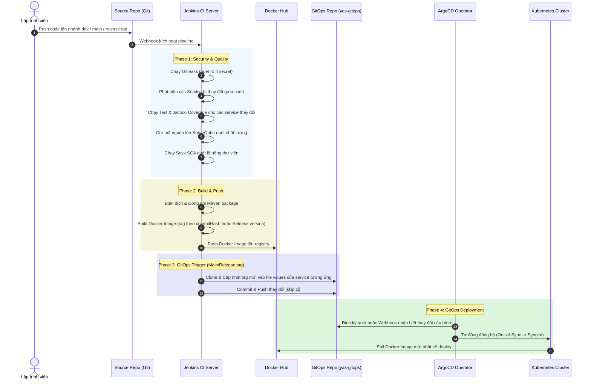

# So Sánh Thay Đổi Và Kiến Trúc Hệ Thống

Tài liệu này trình bày các điểm cải tiến cốt lõi của hệ thống so với phiên bản **Nashtech YAS** gốc, đồng thời mô tả kiến trúc CI/CD và GitOps đang vận hành.

---

## 1. Bảng So Sánh Thay Đổi Cốt Lõi

| Tiêu chí | Nashtech YAS Gốc | Hệ Thống YAS Cải Tiến | Ý nghĩa & Lợi ích |
| :--- | :--- | :--- | :--- |
| **Môi hình Triển khai** | Chạy local bằng Docker Compose hoặc cài đặt thủ công qua Helm. | Vận hành theo mô hình **GitOps** chuẩn hóa, quản lý khai báo qua **ArgoCD** trên Kubernetes. | Đảm bảo tính nhất quán (Single Source of Truth), tự động đồng bộ (Sync) và tự phục hồi cấu hình (Self-healing). |
| **Phân tách Môi trường** | Không phân tách rõ ràng hoặc dùng chung cấu hình cổng (ports). | Phân tách rạch ròi thành 2 Namespace độc lập: **`dev`** và **`staging`** với các file override giá trị riêng biệt. | Tránh xung đột tài nguyên, tăng tính bảo mật, cô lập lỗi và dễ dàng thực hiện quy trình release. |
| **Quản lý Định danh & Routing** | Dùng chung một dải domain `yas.local.com` hoặc dùng port-forwarding. | Chia thành 3 nhóm domain: Infrastructure (`yas.local.com`), Môi trường Dev (`yas.dev.com`), Môi trường Staging (`yas.staging.com`). | Quản lý DNS sạch sẽ, phân định rõ ràng các môi trường từ mức Ingress Controller. |
| **Quy trình CI/CD** | Thủ công hoặc script build đơn giản. | Pipeline tự động hóa hoàn toàn bằng **Jenkins Monorepo Pipeline**, tối ưu hóa việc build/test theo các module bị thay đổi. | Giảm thiểu tối đa thời gian build/test, tự động hóa quy trình đẩy code lên production/staging mà không cần can thiệp thủ công. |
| **Bảo mật & Quét Mã Nguồn** | Phụ thuộc vào kiểm tra thủ công. | Tích hợp **Gitleaks** (quét lộ mật khẩu/token) và **Snyk SCA** (quét lỗ hổng thư viện phụ thuộc) trực tiếp vào Jenkins. | Phát hiện sớm các rủi ro bảo mật trước khi đóng gói và triển khai. |
| **Độ tin cậy & Chịu lỗi** | Các service gọi nhau trực tiếp qua HTTP. Nếu 1 service sập, lỗi sẽ lan truyền (cascade). | Sử dụng **Istio Service Mesh** với cơ chế **Auto-Retry** (thử lại tự động 3 lần đối với lỗi 5xx). | Tăng cường tính kiên cố (Resilience), giảm thiểu lỗi tạm thời (transient faults) và cải thiện trải nghiệm người dùng. |
| **Bảo mật Nội bộ** | Giao tiếp mạng nội bộ không mã hóa và không có kiểm soát truy cập. | Enforce mã hóa **strict mTLS** nội bộ qua `PeerAuthentication` và cấu hình phân quyền truy cập qua `AuthorizationPolicy`. | Đảm bảo nguyên tắc Zero Trust, ngăn chặn tấn công trung gian (Man-in-the-middle) và truy cập trái phép giữa các service. |
| **Giám sát & Tracing** | Đọc log thủ công qua Console hoặc Docker Log. | Hệ thống **Observability tập trung** sử dụng chuẩn **OpenTelemetry (OTel)**, Prometheus, Grafana, Loki (Log) và Tempo (Trace). | Cho phép debug lỗi nhanh chóng thông qua việc liên kết từ vết Log trực tiếp sang Trace Node Graph (Distributed Tracing). |

---

## 2. Kiến Trúc Luồng CI/CD và GitOps

Hệ thống sử dụng mô hình **Monorepo** chứa mã nguồn ứng dụng (kèm theo pipeline Jenkinsfile thông minh) kết hợp với một repository GitOps riêng biệt (`yas-gitops`) chứa mã nguồn Helm Charts và cấu hình ArgoCD.

### Sơ đồ luồng hoạt động (CI/CD & GitOps)

### Chi tiết cơ chế phát hiện thay đổi của Jenkinsfile
Pipeline Jenkinsfile sử dụng một hàm thông minh:
- Nó chạy `git diff` giữa commit hiện tại và commit trước đó (trên nhánh `main`/tag) hoặc so sánh với `origin/main` (trên nhánh phát triển) để tìm các file bị ảnh hưởng.
- Xác định thư mục root của các file thay đổi, kiểm tra xem có chứa file `pom.xml` hay không để nhận diện đó là một Maven Microservice.
- Chỉ chạy các giai đoạn: **Test & Coverage**, **SonarQube**, **Snyk SCA**, và **Build & Push Docker Image** trên đúng các service bị thay đổi đó. Điều này giúp tối ưu hóa tài nguyên hệ thống và đẩy nhanh tốc độ CI/CD.

---
> [!TIP]
> **Quy tắc phân vùng Tag:**
> - Nhánh phát triển (Developer branches): Docker Image tag được lấy theo 7 ký tự đầu của commit hash. Chỉ thực hiện build & push image để chạy test, không cập nhật tự động lên GitOps.
> - Nhánh `main`: Tự động deploy lên môi trường **Dev** (`yas-dev.yaml`). Docker Image tag lấy theo commit hash (và đẩy thêm tag `latest`).
> - Release tags (ví dụ `v1.0.0`): Tự động deploy lên môi trường **Staging** (`yas-staging.yaml`). Docker Image tag trùng với tên release tag.
