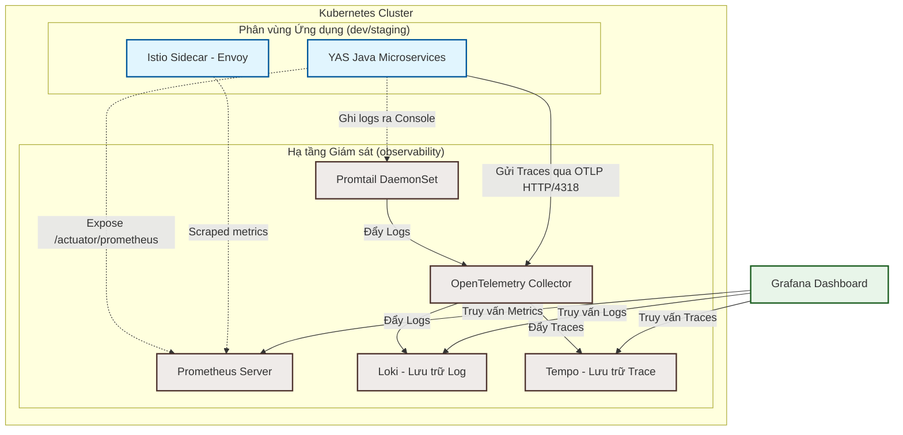

# Hướng Dẫn Chi Tiết Về Giám Sát Hệ Thống (Observability Guide)

Hệ thống YAS (Yet Another Shop) tích hợp hạ tầng giám sát hoàn chỉnh theo chuẩn **Cloud-Native Observability**, giúp đội ngũ vận hành và phát triển có cái nhìn toàn diện về sức khỏe hệ thống. Tài liệu này cung cấp lý thuyết cơ bản, kiến trúc thu thập dữ liệu và hướng dẫn thực hành chi tiết trên giao diện Grafana.

---

## 🗺️ 1. Mô Hình Kiến Trúc Observability Trong YAS

Để đạt được khả năng quan sát toàn diện, hệ thống YAS kết hợp nhiều công cụ mã nguồn mở hàng đầu thông qua cơ chế thu thập dữ liệu tập trung dựa trên **OpenTelemetry**:



---

## 📚 2. Ba Trụ Cột Của Observability & Các Khái Niệm Liên Quan

Khả năng quan sát được xây dựng dựa trên sự kết hợp chặt chẽ của **Metrics (Số liệu đo lường)**, **Logs (Nhật ký sự kiện)**, và **Traces (Truy vết phân tán)**.

### 2.1. Metrics - Đo lường với Prometheus

Metrics là các số liệu thống kê dạng số được thu thập theo chu kỳ thời gian (Time-series data). Chúng trả lời câu hỏi: *"Hệ thống đang hoạt động như thế nào?"* (ví dụ: CPU load bao nhiêu %, có bao nhiêu request/giây).

#### Các kiểu Metric cốt lõi trong Prometheus:
1. **Counter (Bộ đếm tăng dần):** 
   - Giá trị chỉ tăng lên hoặc reset về 0 khi khởi động lại ứng dụng.
   - *Ví dụ:* `http_server_requests_seconds_count` (tổng số request HTTP đã xử lý).
   - *Cách dùng:* Thường kết hợp với hàm `rate()` để tính số request trên giây.
2. **Gauge (Thước đo biến động):**
   - Giá trị có thể tăng hoặc giảm bất kỳ lúc nào.
   - *Ví dụ:* `jvm_memory_used_bytes` (dung lượng RAM đang sử dụng), `process_cpu_usage` (phần trăm CPU hiện tại).
3. **Histogram (Biểu đồ phân phối):**
   - Đo lường tần suất và phân phối của các sự kiện (thường là latency/thời gian phản hồi).
   - Tạo ra nhiều "bucket" (ví dụ: phản hồi dưới 100ms, dưới 500ms, dưới 1s) kèm theo tổng số và tổng giá trị.
   - *Ví dụ:* `http_server_requests_seconds_bucket` giúp tính toán phân vị latency (p50, p90, p99).
4. **Summary (Tóm tắt phân vị):**
   - Tương tự Histogram nhưng phân vị được tính toán trực tiếp từ phía client thay vì server Prometheus.

#### Cách YAS triển khai Metrics:
- Các microservice Java Spring Boot sử dụng **Spring Boot Actuator** tích hợp thư viện **Micrometer**.
- Metrics được expose qua HTTP endpoint chuyên biệt tại: `http://<service-pod>:8090/actuator/prometheus`.
- Prometheus Server tự động gửi request (Scrape) đến các endpoint này mỗi **15 giây** để thu thập dữ liệu.

---

### 2.2. Logs - Nhật ký tập trung với Loki

Logs là các dòng thông tin dạng text ghi lại sự kiện diễn ra tại một thời điểm cụ thể. Chúng trả lời câu hỏi: *"Chuyện gì đã xảy ra tại thời điểm lỗi?"*.

#### Khái niệm chính về Grafana Loki:
- Loki là hệ thống lưu trữ log tối ưu hóa chi phí. Khác với Elasticsearch (index toàn bộ nội dung text), Loki **chỉ index các nhãn metadata (labels)** như `namespace`, `container`, `pod`, `level`. Điều này giúp giảm dung lượng lưu trữ và tăng tốc độ tìm kiếm theo phạm vi.
- **LogQL (Log Query Language):** Ngôn ngữ truy vấn của Loki, có cú pháp tương tự như PromQL.
  - *Bộ lọc nhãn (Label filter):* `{container="product", namespace="dev"}`
  - *Bộ lọc nội dung (Line filter):* `{container="product"} |= "NullPointerException"` (lọc dòng chứa chữ NullPointerException).

#### Cách YAS triển khai Logs:
- Ứng dụng ghi log ra định dạng Console tiêu chuẩn.
- **Promtail** (chạy dưới dạng DaemonSet trên mỗi Node của Minikube) sẽ đọc trực tiếp các file log này từ thư mục `/var/log/pods` của Kubernetes.
- Promtail đính kèm các nhãn cần thiết (namespace, pod name, container name) rồi đẩy log qua **OpenTelemetry Collector** trước khi ghi vào **Loki**.

---

### 2.3. Traces - Truy vết cuộc gọi phân tán với Tempo & OpenTelemetry

Traces theo dõi vòng đời của một request khi nó đi qua hàng loạt các microservice khác nhau trong hệ thống phân tán. Traces trả lời câu hỏi: *"Request này đã đi qua những đâu, chặng nào bị chậm và chậm ở đoạn nào?"*.

```
[Client] ---> (storefront-bff) ---> (product) ---> (database)
  |                 |                  |                |
  |<============== Trace ID: 8a4b9c1d2e3f4a... ==========>|
  |--- Span 1 ------|                  |                |
                    |----- Span 2 -----|                |
                                       |--- Span 3 -----|
```

#### Khái niệm chính về Distributed Tracing:
1. **Trace (Vết):** Đại diện cho một luồng công việc hoàn chỉnh từ đầu đến cuối (ví dụ: 1 click mua hàng). Mỗi trace được định danh bằng một **Trace ID** duy nhất toàn hệ thống.
2. **Span (Nhịp/Phân đoạn):** Đơn vị nhỏ nhất trong trace, đại diện cho một khoảng thời gian xử lý tại một service cụ thể (ví dụ: 1 HTTP Call, 1 SQL query). Mỗi span có `Span ID`, thời gian bắt đầu, thời gian kết thúc và các metadata (tags).
3. **Context Propagation (Truyền ngữ cảnh):** Khi `storefront-bff` gọi sang `product` service qua HTTP, nó phải đính kèm Trace ID vào HTTP Header (chuẩn W3C `traceparent`). Service nhận cuộc gọi sẽ đọc header này để tạo ra các Span con thuộc cùng một Trace ID đó.

#### Cách YAS triển khai Traces:
- Ứng dụng Java sử dụng **Micrometer Tracing** / **OpenTelemetry Agent** để tự động tạo trace và truyền ngữ cảnh.
- Trích xuất tự động Trace ID và đính kèm vào mọi SQL query cũng như các cuộc gọi HTTP Client (`WebClient`, `RestTemplate`).
- Toàn bộ dữ liệu trace được xuất dưới giao thức OTLP (OpenTelemetry Protocol) gửi về **OpenTelemetry Collector** (cổng `4318`), sau đó Collector lưu trữ trực tiếp vào **Tempo**.

---

## 🔗 3. Liên Kết Log-to-Trace (Correlation) - Sức Mạnh Thực Sự

Lỗi hệ thống vi dịch vụ cực kỳ khó debug nếu log và trace nằm ở hai nơi riêng biệt. YAS giải quyết vấn đề này bằng cơ chế **Log-to-Trace Correlation**:

1. **Ghi log có kèm ngữ cảnh Trace:**
   Cấu hình logging trong chart [values.yaml](file:///home/nhatthanh/yas-gitops/charts/yas-configuration/values.yaml#L50-L52) quy định định dạng log:
   ```yaml
   logging:
     pattern:
       level: application=${spring.application.name} traceId=%X{traceId:-} spanId=%X{spanId:-} level=%level
   ```
   Mỗi dòng log xuất ra console sẽ có định dạng dạng:
   `application=product traceId=8a4b9c1d2e3f4a... spanId=1a2b3c... level=ERROR - Lỗi kết nối database`

2. **Cấu hình Derived Fields trên Grafana Loki:**
   Trong file [loki-datasource.yaml](file:///home/nhatthanh/yas-gitops/infrastructure/scripts/observability/grafana/templates/loki-datasource.yaml#L18-L22), chúng ta định nghĩa một trường dẫn xuất:
   ```yaml
   derivedFields:
     - datasourceUid: tempo
       matcherRegex: traceId=(\w*)
       name: traceId
       url: ${__value.raw}
   ```
   **Kết quả:** Khi bạn xem log lỗi của một container trên Grafana Explore (qua Loki), Grafana sẽ tự động nhận diện chuỗi `traceId` từ dòng log, biến nó thành một **đường link màu xanh**. Khi nhấp vào link này, Grafana sẽ mở song song một màn hình (Split screen) hiển thị sơ đồ trace của cuộc gọi đó từ Tempo.

---

## 🚀 4. Hướng Dẫn Sử Dụng Thực Tế Trên grafana.yas.local.com

Đảm bảo bạn đã thêm dòng cấu hình `/etc/hosts` tương ứng với IP Minikube:
```text
192.168.49.2 grafana.yas.local.com
```

### Bước 1: Đăng nhập vào Grafana
- **URL:** [http://grafana.yas.local.com](http://grafana.yas.local.com)
- **Tài khoản mặc định:** `admin` / `admin` (nếu thay đổi trong `cluster-config.yaml`, hãy lấy đúng giá trị đã cấu hình).

---

### Bước 2: Truy cập công cụ Explore (Trình khám phá dữ liệu)
- Nhấp chọn biểu tượng **Explore** (hình chiếc la bàn 🧭) ở thanh menu dọc bên trái.
- Explore là môi trường debug nhanh cực kỳ mạnh mẽ, cho phép chạy trực tiếp các câu lệnh truy vấn mà không cần dựng Dashboard cố định.

---

### Bước 3: Xem Log tập trung (Loki) & Sử dụng LogQL
1. Ở menu thả xuống chọn nguồn dữ liệu (Datasource) ở góc trên bên trái, chọn **Loki**.
2. Sử dụng công cụ **Label filters** để lọc nhanh:
   - Click chọn `namespace` = `dev` (hoặc `staging`).
   - Click chọn `container` = `product` (hoặc microservice bạn đang nghi ngờ bị lỗi).
3. Nhấp nút **Run query** (góc trên bên phải). Giao diện sẽ hiển thị biểu đồ tần suất log và danh sách các dòng log chi tiết.
4. **Viết LogQL nâng cao để tìm lỗi:**
   - Để chỉ tìm log có mức độ lỗi `ERROR` hoặc chứa chữ `Exception`:
     ```logql
     {container="product", namespace="dev"} |= "ERROR"
     ```
   - Lọc và tìm các request có thời gian phản hồi chậm ghi nhận trong log:
     ```logql
     {container="product", namespace="dev"} |= "slow"
     ```

---

### Bước 4: Kỹ thuật chia đôi màn hình Debug (Log-to-Trace)
1. Trong danh sách log Loki vừa lọc được, tìm dòng log lỗi (thường có màu đỏ).
2. Nhấp mở rộng dòng log đó để xem thông tin chi tiết dạng JSON hoặc text.
3. Tìm đến trường `traceId` (sẽ hiển thị dưới dạng liên kết màu xanh có nút link bên cạnh).
4. Nhấp vào liên kết **Tempo** hoặc **traceId**.
5. **Kết quả:** Grafana sẽ tự động chia đôi màn hình (Split screen):
   - **Bên trái:** Tiếp tục hiển thị dòng log Loki bạn đang xem.
   - **Bên phải:** Hiển thị timeline chi tiết của Trace đó từ Tempo. Bạn sẽ thấy chính xác request đó bắt đầu từ service nào, gọi tiếp các service con nào, chặng nào bị lỗi (dòng span có màu đỏ) và tốn bao nhiêu mili-giây.

---

### Bước 5: Xem sơ đồ tương tác đồ họa (Node Graph)
Khi đang xem Trace chi tiết của Tempo ở màn hình bên phải:
1. Nhấp chọn tab **Node Graph** ở phía trên cùng của biểu đồ trace.
2. Giao diện sẽ hiển thị sơ đồ dạng nút (Graph) trực quan hóa đường đi của request:
   - Các hình tròn đại diện cho các microservice tham gia xử lý (ví dụ: `storefront-bff`, `product`, `tax`).
   - Các mũi tên hiển thị chiều gọi request kèm theo latency (ví dụ: `35ms`).
   - Nút nào có lỗi sẽ có viền đỏ cảnh báo, giúp bạn xác định ngay lập tức điểm nghẽn hoặc điểm sụp đổ của chuỗi liên kết.

---

### Bước 6: Truy vấn Metrics hệ thống (Prometheus)
1. Trong giao diện **Explore**, chuyển datasource sang **Prometheus**.
2. Nhập một số câu lệnh PromQL cơ bản vào ô truy vấn để đo lường hiệu năng:
   - **Xem tỷ lệ CPU đang sử dụng của các container trong namespace `dev`:**
     ```promql
     sum(rate(container_cpu_usage_seconds_total{namespace="dev"}[5m])) by (container) * 100
     ```
   - **Đo lượng bộ nhớ RAM (JVM) thực tế mà các microservice đang ngốn:**
     ```promql
     jvm_memory_used_bytes{area="heap", namespace="dev"}
     ```
   - **Xem số lượng HTTP request trả về mã lỗi 5xx trên mỗi microservice:**
     ```promql
     sum(rate(http_server_requests_seconds_count{status=~"5.*"}[5m])) by (application)
     ```
   - **Đo lường thời gian phản hồi p99 (99% request phản hồi dưới mức này) của API:**
     ```promql
     histogram_quantile(0.99, sum(rate(http_server_requests_seconds_bucket[5m])) by (le, uri))
     ```

---

## 💡 5. Tổng Kết Quy Trình Khắc Phục Sự Cố (Troubleshooting Flow)

Khi nhận được thông báo lỗi từ người dùng hoặc hệ thống cảnh báo (Alert):

```
[1. Prometheus Dashboard] ──> Phát hiện lượng lỗi 5xx tăng vọt trên api.yas.dev.com
       │
       ▼
[2. Loki Explore] ──────────> Lọc log namespace 'dev', container tương ứng để tìm dòng ERROR
       │
       ▼
[3. Click traceId Link] ────> Nhấp vào traceId màu xanh của dòng log lỗi
       │
       ▼
[4. Tempo Split View] ──────> Xem sơ đồ Trace, phát hiện Span gọi sang Database bị timeout (màu đỏ)
       │
       ▼
[5. Xử lý sự cố] ───────────> Kiểm tra connection pool của database hoặc tối ưu câu lệnh SQL
```

Tài liệu này cung cấp nền tảng vững chắc để bạn tự tin làm chủ khả năng giám sát hệ thống YAS. Hãy truy cập ngay [grafana.yas.local.com](http://grafana.yas.local.com) để trải nghiệm thực tế các tính năng tuyệt vời này!
