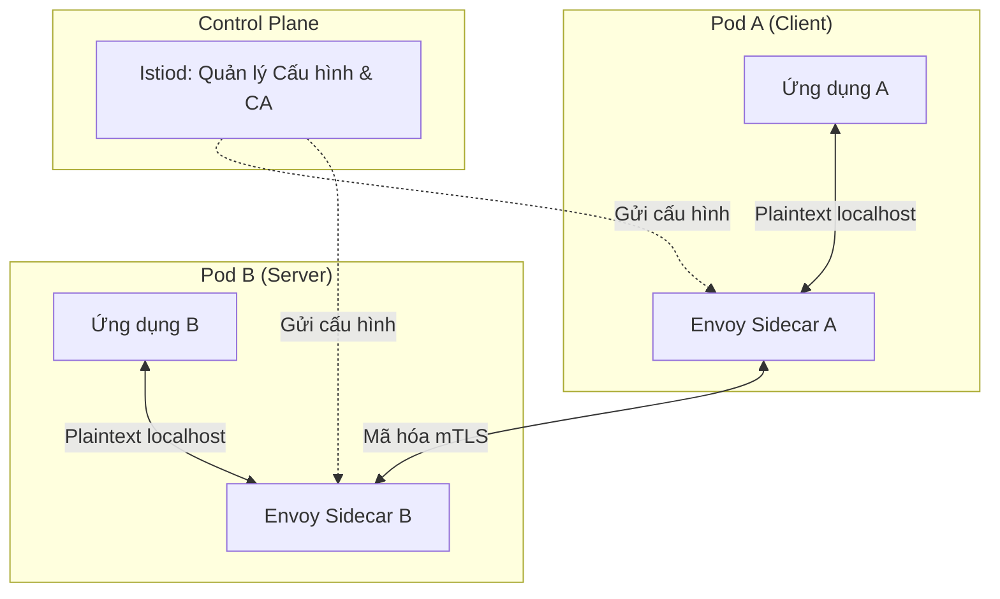
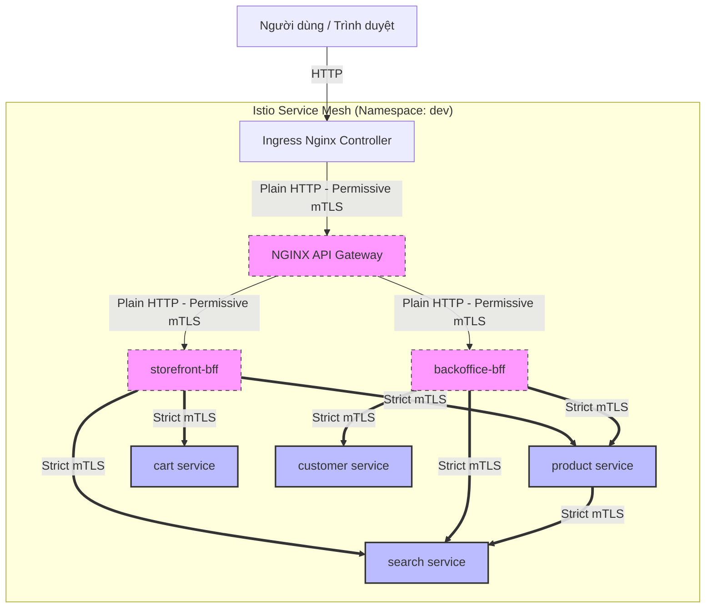
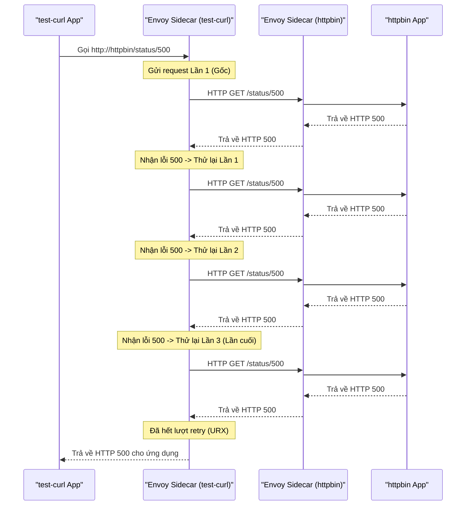

# Lý Thuyết & Thực Hành Istio Service Mesh

Tài liệu này giải thích khái niệm cơ bản về Service Mesh (Istio), cách cấu hình Istio trong hệ thống YAS và các bước thực hành kiểm thử cơ chế phục hồi lỗi (Retry).

---

## 1. Lý Thuyết Về Service Mesh

### 1.1. Service Mesh là gì?
Khi hệ thống chuyển từ kiến trúc đơn khối (Monolith) sang vi dịch vụ (Microservices), số lượng dịch vụ tăng lên kéo theo sự phức tạp trong giao tiếp mạng nội bộ. **Service Mesh** là một tầng hạ tầng chuyên dụng, được cấu hình trực tiếp vào hạ tầng mạng để quản lý giao tiếp giữa các service một cách an toàn, tin cậy và minh bạch.

Istio là một mã nguồn mở Service Mesh phổ biến nhất hiện nay, hoạt động dựa trên hai thành phần chính:
- **Data Plane (Mặt phẳng dữ liệu):** Gồm các mạng lưới proxy thông minh (sử dụng **Envoy Proxy**) được triển khai dưới dạng **Sidecar** chạy song song bên trong mỗi Pod ứng dụng. Mọi traffic ra/vào Pod đều đi qua sidecar proxy này.
- **Control Plane (Mặt phẳng điều khiển):** Thành phần **Istiod** quản lý và cấu hình các sidecar proxy để thực thi các chính sách định tuyến, bảo mật và thu thập dữ liệu giám sát.



### 1.2. Các Lợi Ích Chính
1. **Traffic Management (Quản lý lưu lượng):** Hỗ trợ Canary deployment, A/B testing, tự động thử lại (Retries), cắt mạch (Circuit Breaking) và giới hạn băng thông.
2. **Security (Bảo mật Zero Trust):** Tự động mã hóa lưu lượng mạng nội bộ bằng mTLS, quản lý chứng chỉ số và phân quyền chi tiết (Authorization Policy).
3. **Observability (Khả năng quan sát):** Tự động đo lường phân tán (Distributed Tracing), thu thập metrics dịch vụ và log truy cập mạng.

### 1.3. Sơ đồ Luồng Giao Tiếp (Topology) của YAS trong Service Mesh
Dưới đây là mô hình phân luồng traffic từ ngoài vào trong hệ thống vi dịch vụ YAS khi được nhúng trong Istio Service Mesh:



---

## 2. Cấu Hình Istio Trong Hệ Thống YAS

Hệ thống YAS áp dụng 3 nhóm tài nguyên cấu hình Istio chính:

### 2.1. Mã Hóa Đường Truyền (mTLS) - `PeerAuthentication`
Tệp cấu hình: [mtls-peer-auth.yaml](file:///home/nhatthanh/yas-gitops/environments/dev/service_mesh/mtls-peer-auth.yaml)
- **Chế độ STRICT (Mặc định):** Bắt buộc mọi giao tiếp giữa các Pod nội bộ trong namespace `dev` phải sử dụng mã hóa mTLS. Nếu một Pod không thuộc mesh gọi đến sẽ bị từ chối.
- **Chế độ PERMISSIVE (Ngoại lệ):** Cấu hình riêng cho `nginx`, `storefront-bff`, và `backoffice-bff` do chúng phải nhận lưu lượng plain HTTP chưa mã hóa trực tiếp từ Nginx Ingress Controller (nằm ngoài Mesh).

### 2.2. Kiểm Soát Truy Cập - `AuthorizationPolicy`
Tệp cấu hình: [auth-policy.yaml](file:///home/nhatthanh/yas-gitops/environments/dev/service_mesh/auth-policy.yaml)
- Thiết lập quyền truy cập tối thiểu (Least Privilege).
- Ví dụ: Đối với service `search`, cấu hình chỉ cho phép các yêu cầu đến từ các Service Account `product`, `storefront-bff`, và `backoffice-bff`. Các service khác cố tình gọi sang sẽ bị Envoy block ngay lập tức với mã lỗi `403 Forbidden`.

### 2.3. Khả Năng Chịu Lỗi (Auto-Retry) - `VirtualService`
Tệp cấu hình: [global-retries.yaml](file:///home/nhatthanh/yas-gitops/environments/dev/service_mesh/global-retries.yaml)
- Khi một dịch vụ gặp lỗi tạm thời (chẳng hạn cơ sở dữ liệu bị lock, quá tải đột xuất dẫn đến mã lỗi HTTP 5xx), thay vì trả lỗi trực tiếp về cho client, Envoy Sidecar của client sẽ tự động gửi lại request.
- **Cấu hình áp dụng:**
  - Số lần thử lại tối đa (`attempts`): **3 lần**.
  - Thời gian chờ tối đa cho mỗi lần thử (`perTryTimeout`): **2 giây**.
  - Điều kiện kích hoạt (`retryOn`): `5xx, gateway-error, connect-failure, refused-stream`.

---

## 3. Thực Hành Kiểm Thử Cơ Chế Retry

Để trực quan hóa hoạt động của cơ chế tự động thử lại (Retry) của Istio Envoy, chúng ta sẽ thực hiện một bài test thực tế bằng cách giả lập lỗi HTTP 500.

### Kịch bản thử nghiệm
Chúng ta sử dụng một Client Pod trong mesh là `test-curl` để gọi tới dịch vụ giả lập lỗi `httpbin`. Dịch vụ này có endpoint `/status/500` luôn trả về mã lỗi 500.



### Các bước thực hiện:

#### Bước 1: Deploy tài nguyên kiểm thử
Triển khai Pod `test-curl`, `httpbin` cùng với cấu hình `VirtualService` chứa luật retry riêng cho httpbin:
```bash
kubectl apply -f environments/dev/service_mesh/httpbin-retry-test.yaml
```

#### Bước 2: Thực hiện cuộc gọi giả lập lỗi từ Pod Client
Chạy lệnh curl từ bên trong container `curl` của Pod `test-curl` hướng tới dịch vụ `httpbin`:
```bash
kubectl exec -n dev test-curl -c curl -- curl -s -o /dev/null -w "%{http_code}" http://httpbin/status/500
```
*Kết quả trên terminal sẽ trả ra:* `500`.

#### Bước 3: Phân tích Log của Envoy Proxy tại đầu gửi (`test-curl`)
Xem log của Sidecar proxy (`istio-proxy`) của client:
```bash
kubectl logs -n dev test-curl -c istio-proxy --tail=10
```
> [!IMPORTANT]
> **Dấu hiệu thành công:** Trong log của `test-curl` Envoy sẽ xuất hiện dòng log chứa cờ **`URX`** (Upstream Retry Exhausted) cùng tham số `x-envoy-attempt-count` bằng `4` (1 cuộc gọi gốc + 3 lần thử lại).

#### Bước 4: Phân tích Log của Envoy Proxy tại đầu nhận (`httpbin`)
Xem log của Sidecar proxy phía nhận để kiểm tra số lượng request thực tế đi vào backend:
```bash
kubectl logs -n dev httpbin -c istio-proxy --tail=20 | grep "GET /status/500"
```
> [!IMPORTANT]
> **Dấu hiệu thành công:** Log của `httpbin` Envoy sẽ hiển thị chính xác **4 dòng log** yêu cầu truy cập `GET /status/500` có cùng một giá trị `X-Request-Id` được ghi nhận gần như đồng thời. Điều này chứng minh 1 request bị lỗi từ phía ứng dụng client đã được hạ tầng Envoy tự động nhân lên làm 4 lần thử trước khi từ bỏ.

---

## 4. Thực Hành Kiểm Thử Quyền Truy Cập (Authorization Policy)

Để kiểm chứng tính năng phân quyền truyền thông mạng Zero Trust (`AuthorizationPolicy`), chúng ta giả lập tình huống chỉ cho phép Pod mang Service Account được ủy quyền gọi sang service `search`, đồng thời chặn mọi truy cập từ các Pod không được phép.

### Kịch bản thử nghiệm
- **Pod được cho phép (`authz-allowed`):** Chạy dưới ServiceAccount `storefront-bff`. Theo cấu hình `auth-policy.yaml`, service account này được phép gọi tới service `search`.
- **Pod bị chặn (`authz-denied`):** Chạy dưới ServiceAccount `default`. Service account này không nằm trong danh sách trắng nên kết nối sẽ bị chặn và trả về lỗi 403 Forbidden.

### Các bước thực hiện:

#### Bước 1: Deploy tài nguyên Pod kiểm thử
Triển khai hai Pod kiểm thử mang cấu hình Service Account tương ứng vào namespace `dev`:
```bash
kubectl apply -f environments/dev/service_mesh/authz-test.yaml
```

#### Bước 2: Kiểm tra cuộc gọi từ Pod được phép (Thành công)
Sử dụng Pod `authz-allowed` để gửi yêu cầu lấy tài liệu API của service `search` trên cổng `8090`:
```bash
kubectl exec -n dev authz-allowed -c curl -- curl -s -w "\nHTTP Code: %{http_code}\n" http://search:8090/v3/api-docs
```
> [!IMPORTANT]
> **Kết quả kỳ vọng:**
> - HTTP Code: **`200`** (hoặc nội dung file cấu hình Swagger JSON).
> - Điều này chứng minh Pod mang Service Account được cấu hình trong whitelist có thể đi qua sidecar và kết nối thành công.

#### Bước 3: Kiểm tra cuộc gọi từ Pod KHÔNG được phép (Bị chặn)
Sử dụng Pod `authz-denied` để gửi yêu cầu tương tự tới service `search`:
```bash
kubectl exec -n dev authz-denied -c curl -- curl -s -w "\nHTTP Code: %{http_code}\n" http://search:8090/v3/api-docs
```
> [!IMPORTANT]
> **Kết quả kỳ vọng:**
> - Nội dung phản hồi: **`RBAC: access denied`**
> - HTTP Code: **`403`**
> - Điều này chứng minh Istio Authorization Policy đã hoạt động chính xác, tự động chặn đứng kết nối từ client không hợp lệ ngay tại tầng sidecar proxy nhận (Envoy của search) trước khi chạm tới code ứng dụng.

---

## 5. Quan Sát Mô Hình Mạng Và mTLS Trên Kiali

Sau khi triển khai các chính sách trên, bạn có thể kiểm chứng trực quan bằng Kiali:
1. Mở trang Kiali: `http://localhost:20001`
2. Chọn mục **Graph**, chọn namespace `dev`.
3. Gửi traffic thử nghiệm (ví dụ: truy cập web storefront hoặc chạy các lệnh curl kiểm thử ở trên).
4. Tại góc dưới bên trái, trong cài đặt **Display**, bật **Security** và **Traffic Animation**.
5. **Quan sát:**
   - Bạn sẽ nhìn thấy **Biểu tượng ổ khóa (Padlock)** hiển thị trên các đường liên kết giữa các node (ví dụ: từ `storefront-bff` tới `product`), xác nhận đường truyền đang được mã hóa **strict mTLS**.
   - Các node không có ổ khóa (ví dụ: từ Ingress vào Nginx API Gateway) phản ánh đúng chế độ **permissive mTLS**.
