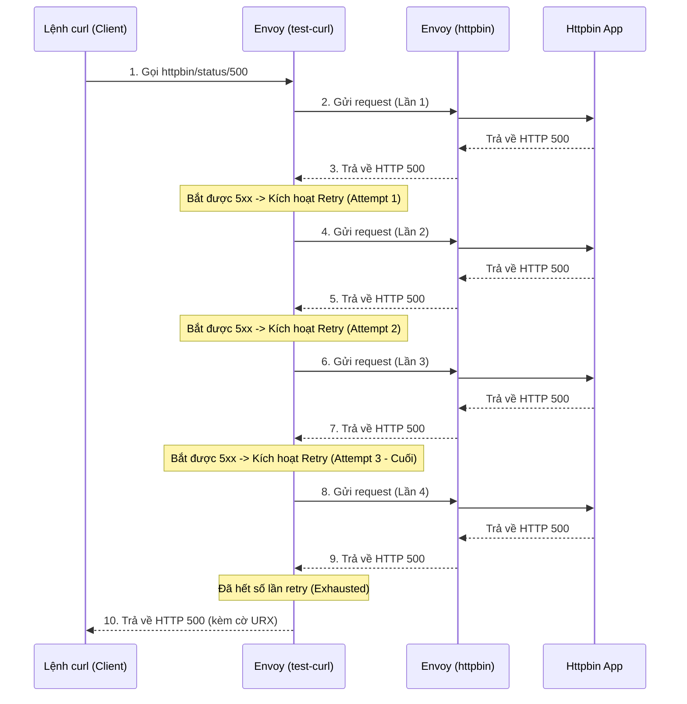

# Kế hoạch & Phân tích Test Retry trong Istio

Tài liệu này mô tả chi tiết cách thức hoạt động, mô hình và các bước kiểm thử cơ chế Retry tự động của Istio (Envoy proxy).

## 1. Mục tiêu
Đảm bảo rằng khi một Service (Upstream) gặp lỗi hoặc quá tải (trả về lỗi 5xx), Istio Sidecar (Envoy) của Client (Caller) sẽ tự động thử lại request một số lần nhất định trước khi thực sự báo lỗi về cho người dùng. Điều này giúp hệ thống chịu lỗi tốt hơn (Resilience).

## 2. Mô hình Test

Chúng ta cần 3 thành phần chính:
1. **Caller (Client):** Một Pod nằm trong Istio mesh (đã được inject Envoy sidecar). Trong bài test, chúng ta sử dụng `test-curl`.
2. **Upstream (Server):** Một Pod đóng vai trò là backend, có khả năng trả về lỗi giả lập. Ở đây chúng ta dùng `httpbin` (có sẵn các API giả lập lỗi như `/status/500`).
3. **VirtualService:** Cấu hình routing của Istio để định nghĩa luật Retry (ví dụ: retry 3 lần, mỗi lần cách nhau 2s, áp dụng cho lỗi 5xx).



## 3. Các bước thực hiện

### Bước 1: Chuẩn bị môi trường (Apply Manifests)
Áp dụng file cấu hình bao gồm `VirtualService` (định nghĩa retry), `Pod/Service httpbin` và `Pod test-curl`.

```bash
kubectl apply -f environments/dev/service_mesh/retry/4-httpbin-retry-test.yaml
```

### Bước 2: Kích hoạt request kiểm thử
Gửi một request từ pod `test-curl` đến `httpbin`, yêu cầu httpbin trả về lỗi 500.

```bash
kubectl exec -n dev test-curl -c curl -- curl -s -o /dev/null -w "%{http_code}" http://httpbin/status/500
```

### Bước 3: Phân tích kết quả (Logs)

Để xác nhận Istio có thực hiện Retry hay không, chúng ta kiểm tra log của Envoy ở cả hai đầu.

> [!TIP]
> **Dấu hiệu thành công:** Log của Caller (test-curl) chỉ có 1 dòng ghi nhận lỗi (kèm cờ URX), trong khi log của Upstream (httpbin) có nhiều dòng (1 gốc + số lần retry) với cùng một Request ID.

#### 3.1. Kiểm tra log của Caller (`test-curl`)
```bash
kubectl logs -n dev test-curl -c istio-proxy --tail=10
```
**Kết quả kỳ vọng:** Thấy log có đoạn `500 URX via_upstream`.
- `URX`: Upstream Retry Exhausted. Chứng tỏ cơ chế retry đã chạy nhưng hết số lần cho phép.
- `x_envoy_attempt_count`: Sẽ bằng 4 (1 gốc + 3 retry).

#### 3.2. Kiểm tra log của Upstream (`httpbin`)
```bash
kubectl logs -n dev httpbin -c istio-proxy --tail=20 | grep "GET /status/500"
```
**Kết quả kỳ vọng:** Có 4 dòng log liên tiếp tại cùng một thời điểm với chung một `X-Request-Id`. Điều này khẳng định 1 request gốc từ người dùng đã được Envoy nhân lên thành 4 request thực tế gửi đến backend.

## 4. Kiểm tra trực quan trên Kiali / Jaeger (Tuỳ chọn)

Ngoài việc đọc log, bạn có thể kiểm chứng qua UI:
- **Kiali (`localhost:20001`):** Xem Topology Graph, chọn namespace `dev`. Traffic sẽ hiển thị tỷ lệ lỗi (Error rate) tương ứng với số lượng request bị đánh rớt.
- **Jaeger (`localhost:16686`):** Tìm Trace của `test-curl`. Bạn sẽ thấy một Trace dài bao gồm nhiều Span con (mỗi span tương ứng với một lần thử lại).

---
*Tài liệu này được tạo ra để lưu trữ lại quá trình kiểm thử tự động phục hồi (Resilience) trong môi trường phát triển (Dev).*
